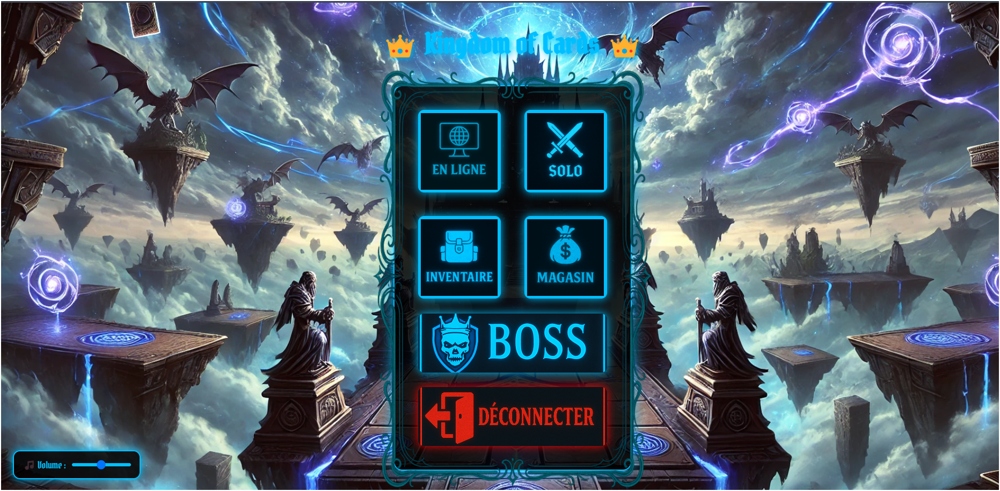
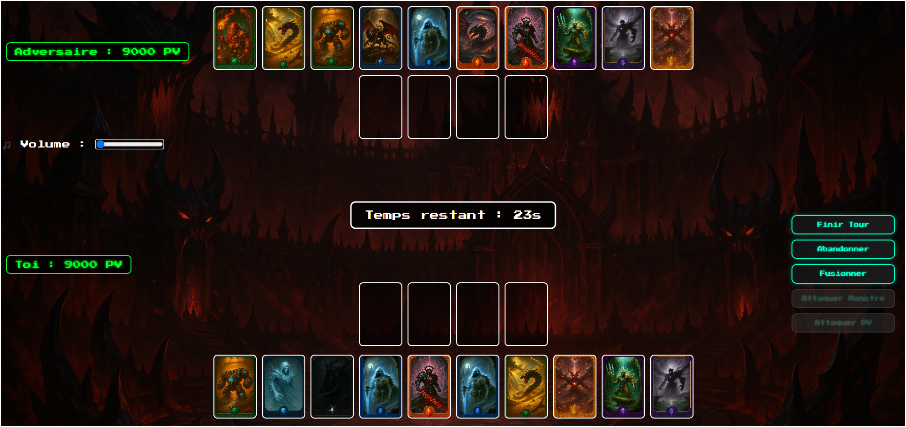
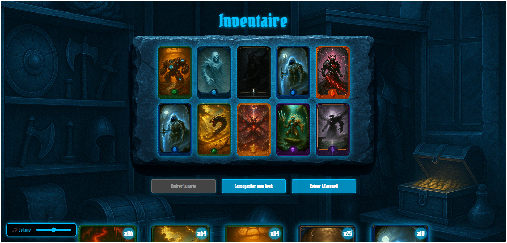

# 👑 Kingdom Of Cards

**Kingdom Of Cards** est un jeu de cartes stratégique multijoueur inspiré de l'univers de Yu-Gi-Oh! développé en PHP, JavaScript, HTML/CSS et MySQL. Il permet aux joueurs de collectionner, gérer et combattre avec des cartes dans plusieurs modes : solo, contre un boss, ou en ligne contre d'autres utilisateurs.

🤝 Projet réalisé dans le cadre du cours TCH099 à l'ÉTS par :

Mohamed Amir Araar : https://github.com/Amir-25
Rayan Habib : https://github.com/Nayar05
Lamine Habib : https://github.com/LamX-05
Najib Tahiri : https://github.com/Kaneki0214
Mohamed Amine M’hammedi : https://github.com/miitosis
Aya Azizi : https://github.com/Aya-prog651


## 📸 Aperçu
Acceuil:

1v1:

inventaire: 

magasin: 


---

## 🎮 Fonctionnalités

- 🔐 Inscription, connexion, déconnexion
- 📧 Récupération de mot de passe avec envoi de mail
- 🃏 Gestion complète des cartes (Inventaire, Deck)
- ⚔️ Duel contre un joueur en ligne (matchmaking)
- 🧠 Mode Solo contre un bot fixe
- 👑 Mode Boss avec un effet spécial unique
- 🛒 Boutique pour acheter de nouveaux packs de cartes
- 💥 Système de fusion de cartes (cartes spéciales)
- 🎵 Contrôle du volume et ambiance sonore
- 🕒 Timer de tour et gestion manuelle de fin de tour

---

## 🛠 Stack technique

| Composante | Technologies utilisées |
|-----------|-------------------------|
| Frontend  | HTML, CSS, JavaScript (Vanilla) |
| Backend   | PHP 8.2 (avec PDO) |
| Base de données | Azure MySQL Server |
| Communication | REST API (JSON), WebSocket (Ratchet) |
| Outils | Visual Studio Code, XAMPP, DBeaver |

---

## 🧪 Installation locale

### 1. Prérequis

- PHP 8+
- MySQL / Azure MySQL
- Apache ou XAMPP
- Composer (pour Ratchet si tu veux activer le WebSocket)

### 2. Étapes

```bash
git clone https://github.com/Amir-25/kingdom_of_cards.git
cd kingdom_of_cards

# Si tu utilises composer pour le WebSocket
composer install

#Accède au jeu via un navigateur avec :
http://localhost/kingdom_of_cards/public/


